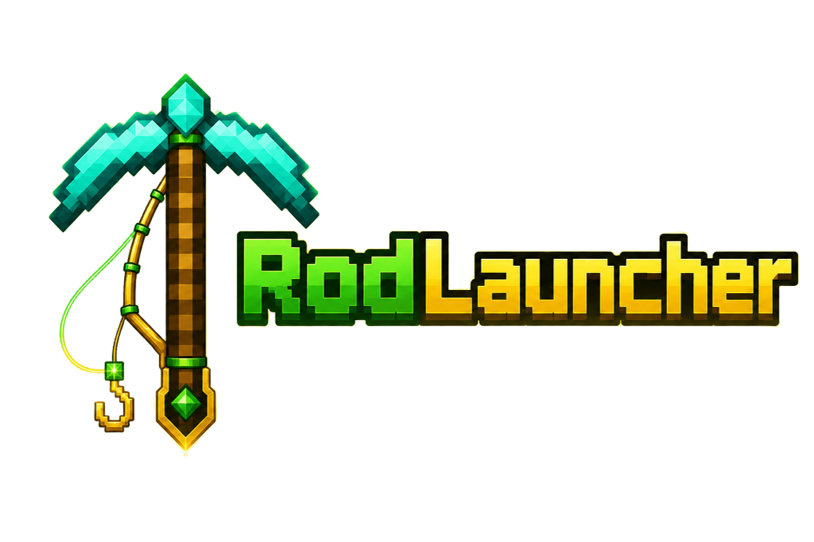

# RodLauncher




**RodLauncher** e um launcher desktop moderno para Minecraft Java, feito para quem quer escolher nick, versao e skin em uma interface bonita, rapida e simples.

Ele baixa arquivos oficiais da Mojang, mostra preview 3D da skin, detecta versoes ja instaladas e prepara tudo em poucos cliques.

> Projeto independente. O RodLauncher nao e afiliado, aprovado ou endossado pela Mojang Studios ou Microsoft.

## O Que Ele Faz

- Escolha de nickname direto na tela inicial.
- Lista de versoes carregada automaticamente pela Mojang.
- Suporte a releases e snapshots.
- Deteccao de versoes ja instaladas na sua `.minecraft`.
- Download de versoes quando necessario.
- Preview 3D da skin no launcher.
- Upload de skin PNG personalizada.
- Barra de progresso durante download/preparacao.
- Tema escuro moderno inspirado em Minecraft.
- Interface com glassmorphism, blur e detalhes verdes.

## Como Usar

1. Abra o RodLauncher.
2. Digite seu nickname.
3. Escolha uma versao do Minecraft.
4. Opcionalmente, carregue uma skin PNG personalizada.
5. Clique em **Jogar**.

Se a versao escolhida ainda nao estiver instalada, o RodLauncher baixa os arquivos oficiais antes de iniciar.

## Download

Quando houver uma versao pronta, baixe pela aba **Releases** do GitHub:

[Baixar RodLauncher](https://github.com/Rodrigomsdevs/rodlauncher/releases)

Se ainda nao houver release publicada, o projeto esta em fase de desenvolvimento.

## Requisitos

- Windows 10 ou Windows 11.
- Java instalado.
- Conexao com a internet para baixar versoes.

Para versoes recentes do Minecraft, use Java 21 ou superior.

Recomendado:

[Baixar Java pela Adoptium](https://adoptium.net/)

## Skin

O RodLauncher mostra uma skin 3D interativa dentro do app.

Por padrao, ele tenta usar uma skin baseada no nickname. Se voce quiser uma skin propria, clique no botao de upload e selecione um arquivo `.png`.

## Onde Os Arquivos Ficam

O launcher usa uma pasta propria para dados do app e tambem verifica a `.minecraft` padrao do Windows para evitar baixar de novo uma versao que voce ja possui.

Pasta comum do Minecraft no Windows:

```text
C:\Users\SEU_USUARIO\AppData\Roaming\.minecraft
```

## Problemas Comuns

**O Minecraft nao abre**

Verifique se o Java esta instalado. Versoes novas do Minecraft podem exigir Java 21+.

**A versao aparece como "Baixar" mesmo ja estando instalada**

Confirme se a versao existe dentro da pasta:

```text
.minecraft\versions
```

**Minha skin nao carregou**

Use uma skin no formato PNG padrao do Minecraft.

## Para Desenvolvedores

Quer rodar o projeto pelo codigo-fonte?

```bash
npm install
npm start
```

Gerar build:

```bash
npm run make
```

Validar codigo:

```bash
npm run typecheck
npm run lint
```

## Tecnologias

- Electron
- React
- TypeScript
- Tailwind CSS
- skinview3d
- XMCL
- Vite

## Aviso Legal

Minecraft e uma marca da Mojang/Microsoft. Este projeto e independente e foi criado para fins educacionais e de uso pessoal.

O RodLauncher nao redistribui arquivos do Minecraft. Os downloads devem vir de fontes oficiais da Mojang.

## Licenca

MIT.
